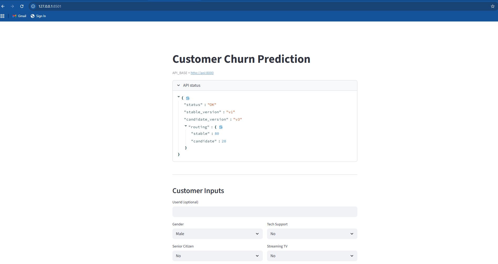
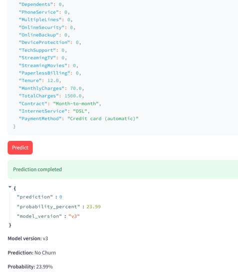
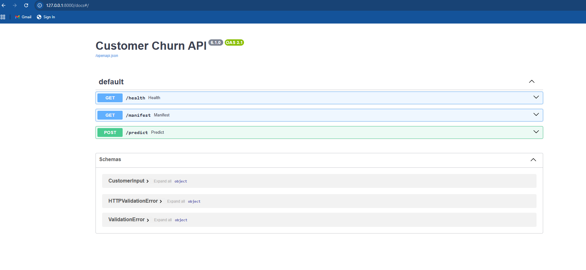
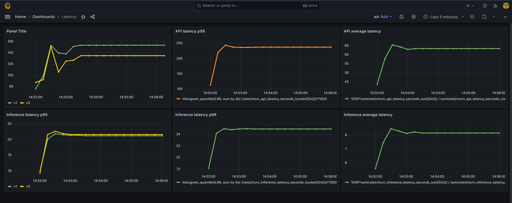
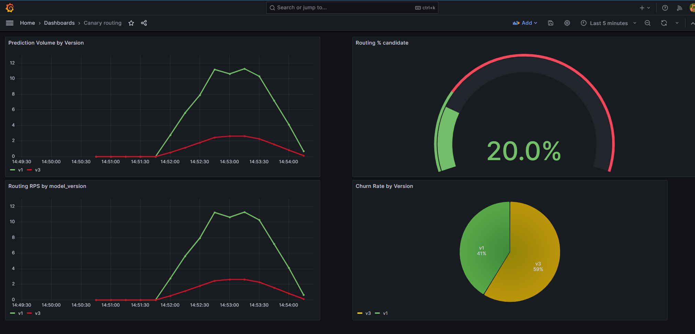
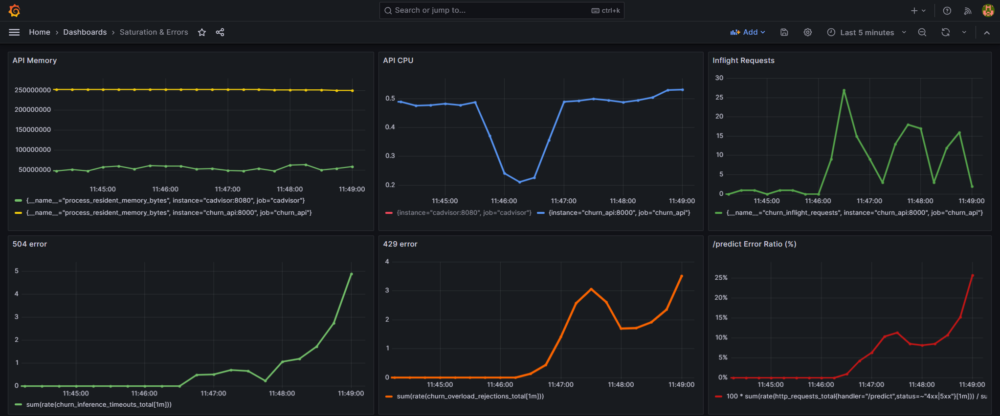
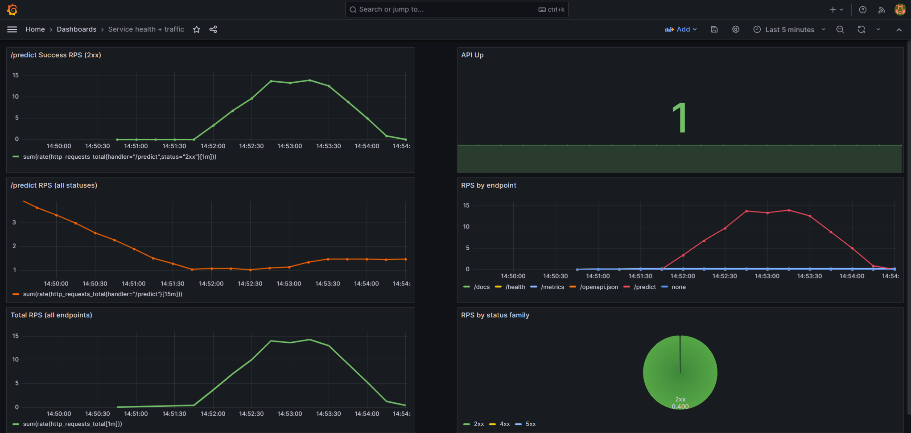
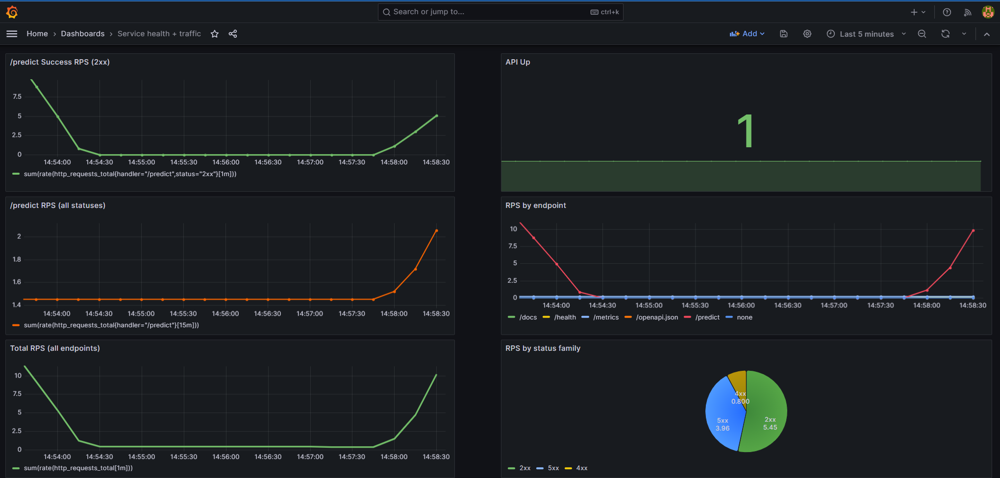

# Churn_MLOps — Production-Style ML Inference Platform

#### A production-style machine learning inference system demonstrating:

- Versioned model serving
- Deterministic canary routing (stable vs candidate)
- Manifest-driven traffic control
- Concurrency limits & backpressure (429 > 504)
- Prometheus-based observability
- Grafana dashboards for latency, routing, and saturation
- PSI-based drift detection
- Automated candidate promotion
- Locust-based load validation

While the example model predicts telecom churn, the architecture is **model-agnostic** and designed to simulate how production ML systems operate in real companies.

---
## Live Demo

**Deployed Application:**  
https://churn-mlops-system-fyid.onrender.com/

This live demo provides an interactive interface for telecom churn prediction powered by a production-style ML inference pipeline.

The deployment runs a **Streamlit UI** that communicates with an internal **FastAPI inference service** within the same container.

Users can:

- Enter customer features and generate churn predictions
- View prediction probability and model version
- Interact with the system through a simple web interface
- Validate real-time inference behavior

Note: The public demo exposes the Streamlit UI and inference workflow.  
The full observability stack (Prometheus, Grafana, Airflow) is available in the **local Docker environment**.

---
## Application Screenshots

<table>
<tr>
<td width="50%">

### Streamlit UI



</td>
<td width="50%">

### Prediction Example



</td>
</tr>
</table>

### API Documentation (FastAPI)



---

## Architecture Overview

Client  
↓  
FastAPI Inference Layer  
↓  
Version Router (`manifest.json`)  
↓  
Stable Model / Candidate Model  
↓  
Metrics → Prometheus → Grafana  

Key components:

- `models/churn/vX` — Versioned models
- `manifest.json` — Controls stable vs candidate routing
- Deterministic SHA-based traffic bucketing
- Structured JSONL prediction logging
- Prometheus custom metrics
- Backpressure control via concurrency limits

---

## Core Capabilities


### Versioned Model Serving

Models are stored as independent versions:

```
models/churn/v1
models/churn/v2
models/churn/v3
```


Routing is controlled through:

```
manifest.json
```


which defines:

- stable_version
- candidate_version
- routing weights
- previous_stable_version


### Deterministic Canary Routing

Traffic can be split between models (example: **80% stable / 20% candidate**).

Routing is deterministic per request using hash bucketing, ensuring:

- reproducible routing behavior
- stable traffic distribution
- version-aware metrics

Metrics exposed:

- `churn_routing_total`


### Concurrency & Backpressure

The system enforces:

- `MAX_INFLIGHT_INFERENCES`
- queue timeout
- inference timeout

Design philosophy:

Prefer **429 (controlled rejection)**  
over **504 (timeout under overload)**.

This ensures:

- predictable failure behavior
- no cascading latency spikes
- stable recovery after load normalization


### Observability

The system exposes operational metrics using **Prometheus** and visualizes them through **Grafana dashboards**.

Metrics capture prediction throughput, routing distribution, API latency, inference latency, and system saturation.

A detailed description of metrics and dashboards is provided in the **Monitoring & Observability** section below.


---
### Drift Detection & Promotion

The platform includes automated monitoring for feature distribution drift using **Population Stability Index (PSI)** and supports automated candidate model promotion.

Detailed drift monitoring workflow and promotion logic are described in the **Drift Detection & Model Promotion** section below.

---

## Load Testing

The system includes **Locust-based load testing**.

Test scenarios:

- baseline load
- target load
- stress testing

Expected system behavior:

- 0 failures under baseline
- controlled 429 responses under saturation
- 504 errors remain lower than 429
- service recovers cleanly after load stops

Detailed instructions are available in the `loadtest` directory.

---

## Local Setup

Clone the repository:

```bash
git clone https://github.com/Narendra1112/churn-mlops-system.git
cd churn-mlops-system
```

Install dependencies:

```bash
pip install -r requirements.txt
```

Start the FastAPI backend:

```bash
uvicorn api.app:app --reload
```
Start the Streamlit UI:

```bash
streamlit run streamlit/app.py
```

Start the monitoring stack (Prometheus + Grafana):

```bash
docker compose up -d
```

Optional: start Airflow for automated retraining:

```bash
docker compose -f docker-compose-airflow.yml up -d
```
---

## Local Service Endpoints

FastAPI Docs  
http://localhost:8000/docs

Streamlit UI  
http://localhost:8501

Prometheus  
http://localhost:9090

Grafana  
http://localhost:3000

Airflow  
http://localhost:8080


---

## API Example

### Request

```json

{
    "UserId": "u1",
    "Gender": 0,
    "SeniorCitizen": 0,
    "Partner": 0,
    "Dependents": 0,
    "PhoneService": 0,
    "MultipleLines": 0,
    "OnlineSecurity": 0,
    "OnlineBackup": 0,
    "DeviceProtection": 0,
    "TechSupport": 0,
    "StreamingTV": 0,
    "StreamingMovies": 0,
    "PaperlessBilling": 0,
    "Tenure": 12,
    "MonthlyCharges": 70.0,
    "TotalCharges": 1500.0,
    "Contract": "Month-to-month",
    "InternetService": "DSL",
    "PaymentMethod": "Credit card (automatic)"
  }

```

### Response

```json
{
  "prediction": 0,
  "probability_percent": 23.99,
  "model_version": "v3"
}
```

The API returns:

- `prediction` → churn class (0 = no churn, 1 = churn)
- `probability_percent` → predicted churn probability
- `model_version` → model version used for inference


## Project Structure

```
churn-mlops-system/
│
├── api/ # FastAPI inference service
│ ├── app.py
│ ├── concurrency.py
│ ├── inference_runtime.py
│ └── timeouts.py
│
├── models/ # Versioned model artifacts
│ └── churn/
│ ├── v1/
│ ├── v2/
│ └── v3/
│
├── monitoring/ # Drift detection and traffic generation
│ ├── create_baseline.py
│ ├── generate_traffic.py
│ └── psi_drift.py
│
├── ops/ # Operational automation scripts
│ ├── auto_promote.py
│ └── preflight.py
│
├── streamlit/ # Streamlit UI
│ └── app.py
│
├── loadtest/ # Locust load testing
│ └── locustfile.py
│
├── assests/ # Dashboard screenshots
│ └── dashboards/
│
├── docker-compose.yml # Core services
├── docker-compose-airflow.yml
├── payload.json
└── README.md
```

This structure separates:

- **Inference layer** (`api`)
- **Model versions** (`models`)
- **Monitoring & drift detection**
- **Operational automation**
- **UI**
- **Load testing**
- **Infrastructure configs**


---

## Load Testing

The system includes **Locust-based load testing** to validate inference stability, concurrency limits, and overload behavior.

Load tests simulate different traffic levels against the `/predict` endpoint to verify:

- API latency under increasing load
- concurrency limit enforcement
- backpressure behavior
- service stability during overload
- recovery after traffic normalization

Test scenarios include:

- **Baseline Load** — light traffic to validate normal operation
- **Target Load** — moderate traffic representing expected production usage
- **Stress Test** — high traffic to intentionally trigger concurrency limits

Under overload conditions, the system is designed to:

- return **429 (Too Many Requests)** when concurrency limits are reached
- minimize **504 timeouts**
- maintain stable API responsiveness
- recover cleanly after traffic subsides

Load testing is implemented using **Locust** and located in:

```
loadtest/
```

Detailed instructions and test scenarios are available in:

```
loadtest/README.md
```

---

## Monitoring & Observability

The system exposes runtime metrics for monitoring model behavior, API performance, and system saturation.

Metrics are exported using **Prometheus** and visualized through **Grafana dashboards**.

Key metrics include:

- `churn_predictions_total` — total number of predictions served
- `churn_routing_total` — traffic routed to each model version
- `churn_api_latency_seconds` — API request latency
- `churn_inference_latency_seconds` — model inference latency
- `churn_overload_rejections_total` — requests rejected due to concurrency limits
- `churn_inference_timeouts_total` — inference timeouts
- `churn_inflight_requests` — active inference requests

Grafana dashboards provide visibility into:

- request latency percentiles
- canary routing distribution
- service health
- system saturation under load

Dashboard screenshots are available in:

```
assests/dashboards/
```
## Dashboard Examples

### API Latency - Normal traffic



### Canary Routing Distribution - Normal traffic



### System Saturation and errors



### Service Health - Normal traffic



### Service Health - Overload traffic




---

## Drift Detection & Model Promotion

The system includes scripts for monitoring feature distribution drift using **pulation Stability Index (PSI)**

Drift monitoring compares incoming prediction data against a baseline distribution to detect shifts in feature behavior that may degrade model performance.

Drift detection workflow:

1. Generate baseline statistics from historical training data
2. Monitor live prediction feature distributions
3. Compute PSI values for each monitored feature
4. Flag significant distribution changes

Drift detection scripts are located in:

```
monitoring/
```

Key scripts:

- `create_baseline.py` — generates baseline feature distributions
- `psi_drift.py` — computes PSI scores for live prediction data
- `generate_traffic.py` — produces synthetic traffic for testing

Drift monitoring and promotion logic are implemented as operational scripts and can be executed manually or scheduled via orchestration tools such as Airflow.

---

### Candidate Model Promotion

Candidate models can be promoted to stable production models using an automated promotion script once validation conditions are met.

Promotion logic is implemented in:

```
ops/auto_promote.py
```


Promotion conditions include:

- sufficient inference traffic
- acceptable PSI drift levels
- healthy service behavior
- stable latency metrics

Once validated, the promotion script updates:

```
manifest.json
```

to move the candidate model into the **stable serving position**.

---

## License

This project is licensed under the **MIT License**.

You are free to use, modify, and distribute this software for personal or commercial purposes, provided that the original copyright and license notice are included in any copies or substantial portions of the software.

See the `LICENSE` file for full license details.